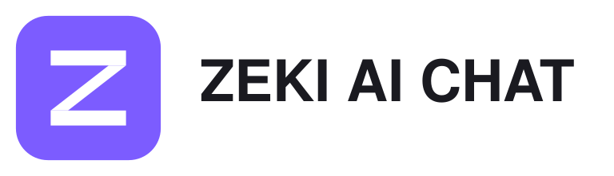

# ZEKI AI CHAT

Portal ile tek oturum açma kullanan, kendi sunucunuzda çalışan ekip sohbeti.

## BI deposundaki konum

Bu ürün artık BI deposunun `apps/zeki-chat/` dizinindedir; ayrı Git deposu veya submodule gerekmez. Bağımlılık komutları bu dizinde çalıştırılır. BI kökünden sunucu derlemesi: `bash deploy/zeki/build-chat.sh`. Kaynak taşıma ve kurulum ayrıntıları: [BI sohbet kurulumu](../../docs/ZEKI-CHAT.md).

## Kurulum

Kaynak `main` üzerinden alınır. Docker kurulumu `deploy/zeki/docker-compose.yml`, sunucu derlemesi `deploy/zeki/build.sh` içindedir. Gizli ayarlar yalnız sunucudaki `.env` dosyasında tutulur; depoya eklenmez.

Sunucuda Node sürümü `package.json` ile aynı olmalıdır. Bağımlılıklar `yarn install` ile hazırlanır. `REPO`, `DIST`, `IMAGE` ve `ZEKI_CODE_VERSION` derleme ortamından verilebilir. `SKIP_RESTART=1` yalnız imaj üretir. Compose çalıştırılırken `ZEKI_CHAT_IMAGE` doğrulanan imaj etiketini göstermelidir.

Mevcut MongoDB ve dosya hacimleri korunmalıdır. Yeni kurulum, gerçek portal oturumu ve gerçek veritabanı üzerinden doğrulanmadan üretim kabulü sayılmaz.

## Marka ve dış servisler

Kullanıcıya görünen ürün adı **ZEKI AI CHAT**. Kaynak denetimi, değişiklik kapsamı ve doğrulama sınırları [marka denetimi](docs/zeki-branding-audit.md) belgesindedir. Her özellik kendi entegrasyonuna ve yetkilendirmesine bağlıdır; marka değişikliği bütün özelliklerin hazır olduğu anlamına gelmez.

## Kaynak bildirimleri

Bağımsız üçüncü taraf bileşenlerin [lisans ve telif bildirimleri](apps/meteor/licenses/THIRD-PARTY-LICENSES.md) dağıtımın parçasıdır.
